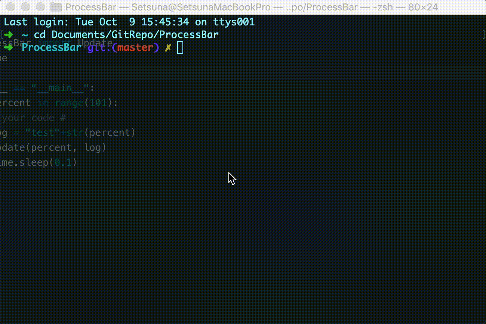

#### ProcessBar

---

##### Demo




#### How to use

---

##### Python3

Put `libProcessBar.so` and `ProcessBar.py` into workspace.

```python
import ProcessBar

for percent in range(101):
    # your code #
    Update(percent, log)
```


